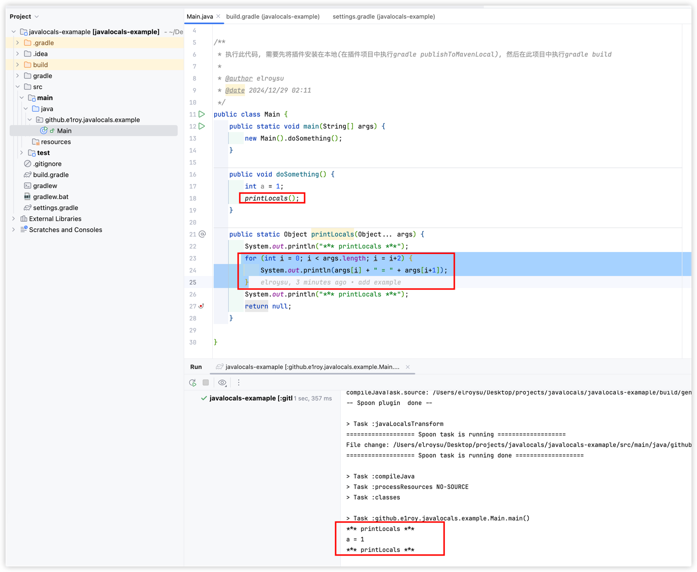

# 背景 
当发生异常的时候/测试环境下, 想看到的参数不在log的输入日志中, 问题排查困难. 希望能够打印所有的上下文信息,而不用一个个参数增加.

参考python的locals()函数,实现在java的log中打印所有的上下文信息.
```python
def add(a, b):
    c = a + b 
    print(locals()) # 输出 : {'a': 1, 'b': 2, 'c': 3}
    return a + b
add(1, 2)
```

## 两种实现方式
- 编译期间: `源代码.java` -> `修改后的源代码.java` -> `*.class`
- jvmti运行时 : 调用jni接口, 获取当前函数的所有局部变量

# 使用 
```shell
    plugins {
        id 'java'
        id 'io.github.e1roy.javalocals' version '0.0.1-test'
    }
    
    javaLocals {
        enable true        
        compileOriginalSources false  
        compliance 11                
        processors = ['io.github.e1roy.JavaLocalsProcessor']  
        fillMethodName = "printLocals"    
    }
```



# 代码示例
1. 源代码
```java
    // 希望在 printLocals 中能够打印a,b,c的值
    public void add(int a, int b) {
        int c = a + b;
        printLocals();
        int d = 0;
    }
```
2. 使用插件重新编译生成的代码
```java
    // 生成
    public void add(int a, int b) {
        int c = a + b;
        printLocals("a", a, "b", b, "c", c);
        int d = 0;
    }
```
3. 执行测试
```java
    // 输出 :
    // printLocals: [a, 1, b, 2, c, 3]
    @Test
    public void testAdd() {
        new DemoFile().add(1, 2);
    }

```

# TODO
- [x] 增加测试用例
- [x] 打包gradle插件
- [ ] 多工程项目测试
- [ ] 测试一个较大的工程
- [ ] 迁移jni的代码 : https://github.com/e1roy/jvmlocals

# 技术栈
- spoon : 源代码解析和修改
- gradle : 插件

# 发布
```shell 发布检查
 ./gradlew publishPlugins --validate-only
```
```shell 发布上产到仓库
./gradlew publishPlugins
```
```shell 发布到本地仓库
./gradlew publishToMavenLocal
```